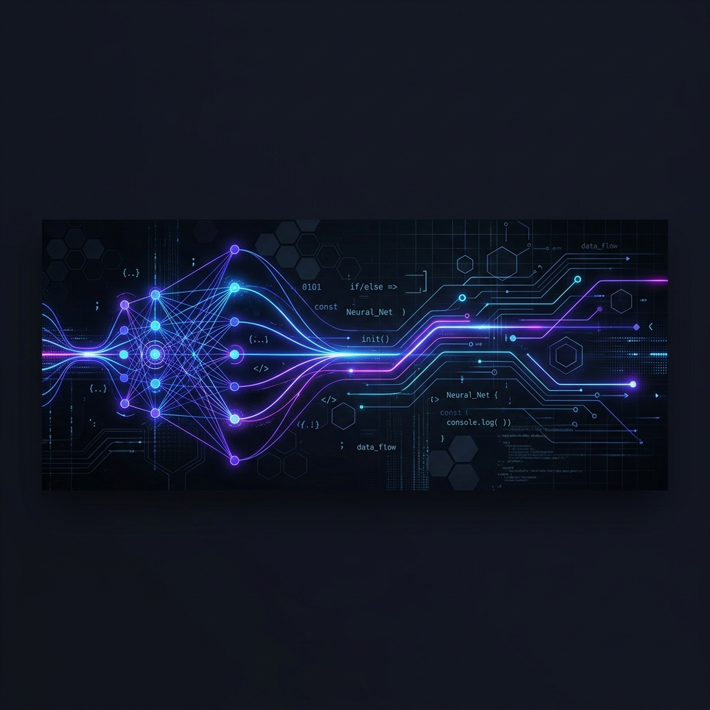

  

<h1 align="center">Hey there! I'm Keerthi Kumar R 👋</h1>

  

  
  
  

---

### 💫 About Me

- 🎓 **Education**: Currently pursuing my **Bachelors in Computer Science Engineering**, specializing in **Artificial Intelligence & Machine Learning**.
- 🚀 **Open Source**: Just starting out my open-source journey, eager to collaborate on meaningful projects and contribute to the community.
- 💡 **Competitive Programming**: Passionate about solving complex algorithms and data structures. Active participant on platforms like LeetCode and Codeforces.
- ⚙️ **Focus**: Deepening my knowledge in Machine Learning algorithms, Data Structures, and Software Engineering best practices.

---

### 🛠️ Tech Stack & Skills

  
<strong>💻 Programming Languages</strong>

   
  

    
    
    
    
    
  

  
<strong>🌐 Web Development</strong>

   
  

    
    
  

  
<strong>🧠 AI / ML & Data Science</strong>

   
  

    
    
    
    
    
  

  
<strong>🔧 Tools & DevOps</strong>

   
  

    
    
    
    
  

---

### 📊 GitHub Analytics

  

  

  <a href="#-contribution-snake-animation">
    <picture>
      <source media="(prefers-color-scheme: dark)" srcset="./assets/github-snake-dark.svg" />
      <source media="(prefers-color-scheme: light)" srcset="./assets/github-snake.svg" />
      
    </picture>
  </a>

